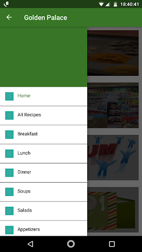
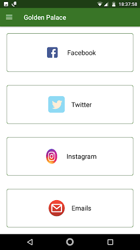
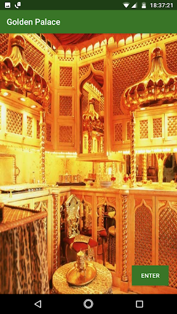
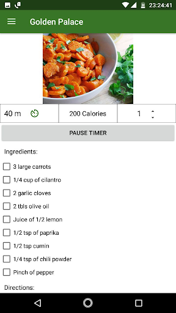

# Application Development for Smart Devices

This repository contains all the final project source code, presentation slide deck, and the final short report submitted for the Application Development for Smart Devices Course at Old Dominion Univeristy (ODU).

This was the first course I took at ODU, it entailed 3 base applications and 1 final application that counted towards the course project.

3 base applications and their source code, along with reports are contained within this repository

1. [To-Do list](https://github.com/niphadkarneha/MoroccanFoodReceipes/tree/master/TodoList)
2. [Contacts list](https://play.google.com/store/apps/details?id=com.phoenix.nehaniphadkar.contacts) Published on Google Store
3. [Localization using Google Maps API](https://github.com/niphadkarneha/MoroccanFoodReceipes/tree/master/Localization)

For the final project, we decided to develop a Moroccon Food Receipes application which had a timer, ingridients calculator, and forums page.

